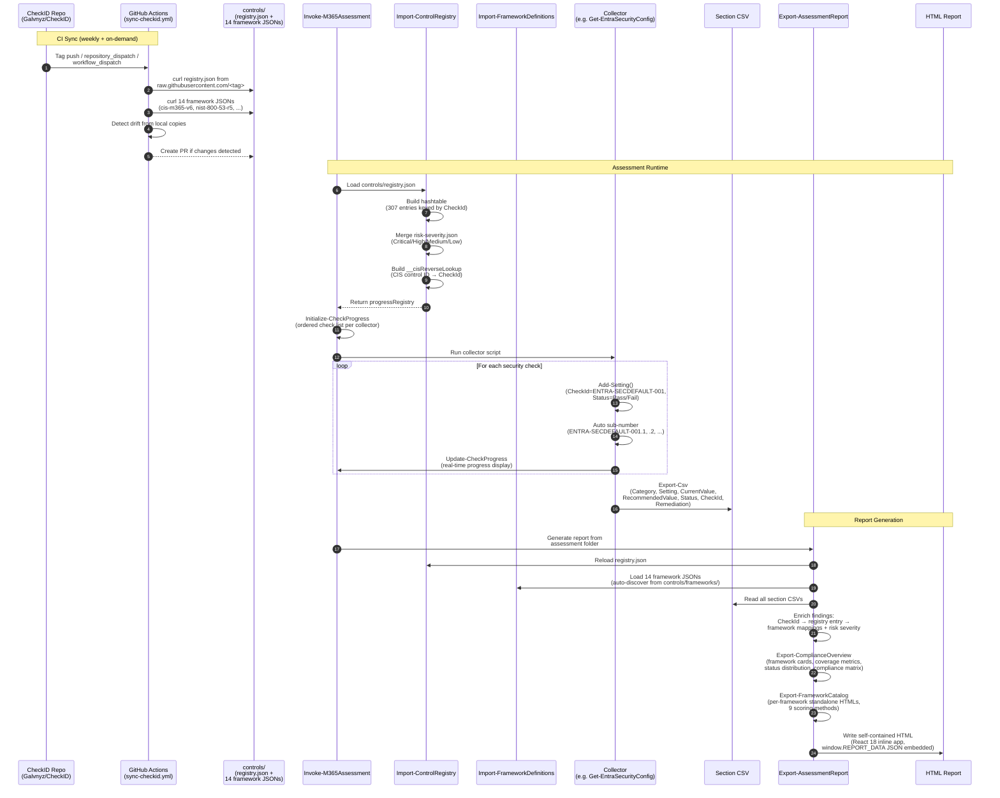

# CheckId Data Flow

Traces how a control definition originates in CheckID, syncs into M365-Assess via CI, gets consumed by collectors at runtime, and surfaces in the final HTML report.

```mermaid
sequenceDiagram
    autonumber

    participant CID as CheckID Repo<br/>(Galvnyz/CheckID)
    participant GHA as GitHub Actions<br/>(sync-checkid.yml)
    participant CTL as controls/<br/>(registry.json +<br/>14 framework JSONs)
    participant ORC as Invoke-M365Assessment
    participant REG as Import-ControlRegistry
    participant FWD as Import-FrameworkDefinitions
    participant COL as Collector<br/>(e.g. Get-EntraSecurityConfig)
    participant CSV as Section CSV
    participant RPT as Export-AssessmentReport
    participant OUT as HTML Report

    note over CID,GHA: CI Sync (weekly + on-demand)

    CID->>GHA: Tag push / repository_dispatch /<br/>workflow_dispatch
    GHA->>CTL: curl registry.json from<br/>raw.githubusercontent.com/<tag>
    GHA->>CTL: curl 14 framework JSONs<br/>(cis-m365-v6, nist-800-53-r5, ...)
    GHA->>GHA: Detect drift from local copies
    GHA-->>CTL: Create PR if changes detected

    note over ORC,OUT: Assessment Runtime

    ORC->>REG: Load controls/registry.json
    REG->>REG: Build hashtable<br/>(307 entries keyed by CheckId)
    REG->>REG: Merge risk-severity.json<br/>(Critical/High/Medium/Low)
    REG->>REG: Build __cisReverseLookup<br/>(CIS control ID → CheckId)
    REG-->>ORC: Return progressRegistry

    ORC->>ORC: Initialize-CheckProgress<br/>(ordered check list per collector)

    ORC->>COL: Run collector script

    loop For each security check
        COL->>COL: Add-Setting()<br/>(CheckId=ENTRA-SECDEFAULT-001,<br/>Status=Pass/Fail)
        COL->>COL: Auto sub-number<br/>(ENTRA-SECDEFAULT-001.1, .2, ...)
        COL->>ORC: Update-CheckProgress<br/>(real-time progress display)
    end

    COL->>CSV: Export-Csv<br/>(Category, Setting, CurrentValue,<br/>RecommendedValue, Status, CheckId,<br/>Remediation)

    note over RPT,OUT: Report Generation

    ORC->>RPT: Generate report from<br/>assessment folder

    RPT->>REG: Reload registry.json
    RPT->>FWD: Load 14 framework JSONs<br/>(auto-discover from controls/frameworks/)
    RPT->>CSV: Read all section CSVs

    RPT->>RPT: Enrich findings:<br/>CheckId → registry entry →<br/>framework mappings + risk severity

    RPT->>RPT: Export-ComplianceOverview<br/>(framework cards, coverage metrics,<br/>status distribution, compliance matrix)

    RPT->>RPT: Export-FrameworkCatalog<br/>(per-framework standalone HTMLs,<br/>9 scoring methods)

    RPT->>OUT: Write self-contained HTML<br/>(React 18 inline app,<br/>window.REPORT_DATA JSON embedded)
```
