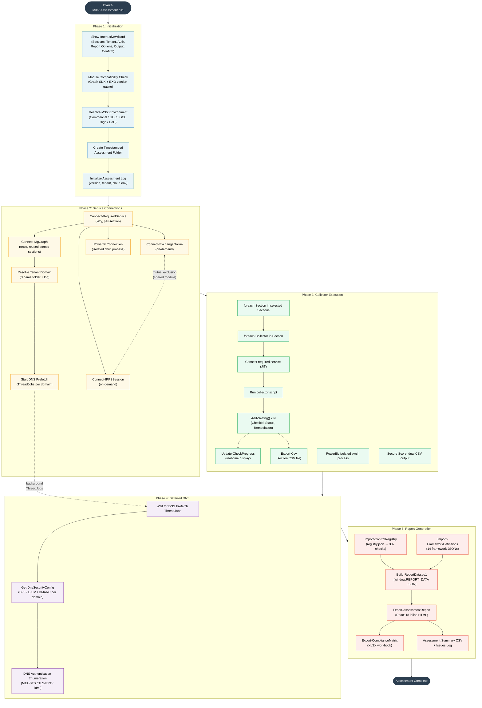

# Core Assessment Pipeline

End-to-end flow from user invocation through report generation. The assessment executes in 5 sequential phases, with async DNS prefetch overlapping Phase 3.

```mermaid
graph TD
    Start([Invoke-M365Assessment.ps1]) --> P1

    subgraph P1["Phase 1: Initialization"]
        direction TB
        Wizard["Show-InteractiveWizard<br/>(Sections, Tenant, Auth,<br/>Report Options, Output, Confirm)"]
        ModCheck["Module Compatibility Check<br/>(Graph SDK + EXO version gating)"]
        CloudDetect["Resolve-M365Environment<br/>(Commercial / GCC / GCC High / DoD)"]
        OutputSetup["Create Timestamped<br/>Assessment Folder"]
        LogInit["Initialize Assessment Log<br/>(version, tenant, cloud env)"]

        Wizard --> ModCheck --> CloudDetect --> OutputSetup --> LogInit
    end

    P1 --> P2

    subgraph P2["Phase 2: Service Connections"]
        direction TB
        ConnSvc["Connect-RequiredService<br/>(lazy, per-section)"]
        Graph["Connect-MgGraph<br/>(once, reused across sections)"]
        DomainResolve["Resolve Tenant Domain<br/>(rename folder + log)"]
        DnsPrefetch["Start DNS Prefetch<br/>(ThreadJobs per domain)"]
        EXO["Connect-ExchangeOnline<br/>(on-demand)"]
        Purview["Connect-IPPSSession<br/>(on-demand)"]
        PBI["PowerBI Connection<br/>(isolated child process)"]

        ConnSvc --> Graph --> DomainResolve --> DnsPrefetch
        ConnSvc --> EXO
        ConnSvc --> Purview
        ConnSvc --> PBI
        EXO <-..->|"mutual exclusion<br/>(shared module)"| Purview
    end

    P2 --> P3

    subgraph P3["Phase 3: Collector Execution"]
        direction TB
        SectionLoop["foreach Section in selected Sections"]
        CollectorLoop["foreach Collector in Section"]
        ConnJIT["Connect required service (JIT)"]
        RunScript["Run collector script"]
        AddSetting["Add-Setting() x N<br/>(CheckId, Status, Remediation)"]
        Progress["Update-CheckProgress<br/>(real-time display)"]
        ExportCsv["Export-Csv<br/>(section CSV file)"]

        SectionLoop --> CollectorLoop --> ConnJIT --> RunScript
        RunScript --> AddSetting --> Progress
        AddSetting --> ExportCsv

        PBINote["PowerBI: isolated pwsh process"]
        SecScore["Secure Score: dual CSV output"]
    end

    P3 --> P4

    subgraph P4["Phase 4: Deferred DNS"]
        direction TB
        WaitJobs["Wait for DNS Prefetch ThreadJobs"]
        DnsAuth["Get-DnsSecurityConfig<br/>(SPF / DKIM / DMARC per domain)"]
        DnsSec["DNS Authentication Enumeration<br/>(MTA-STS / TLS-RPT / BIMI)"]

        WaitJobs --> DnsAuth --> DnsSec
    end

    P4 --> P5

    subgraph P5["Phase 5: Report Generation"]
        direction TB
        LoadReg["Import-ControlRegistry<br/>(registry.json → 307 checks)"]
        LoadFw["Import-FrameworkDefinitions<br/>(14 framework JSONs)"]
        GenReport["Export-AssessmentReport<br/>(React 18 inline HTML)"]
        BuildData["Build-ReportData.ps1<br/>(window.REPORT_DATA JSON)"]
        XLSX["Export-ComplianceMatrix<br/>(XLSX workbook)"]
        Summary["Assessment Summary CSV<br/>+ Issues Log"]

        LoadReg --> BuildData
        LoadFw --> BuildData
        BuildData --> GenReport
        GenReport --> XLSX
        GenReport --> Summary
    end

    P5 --> Done([Assessment Complete])

    %% Async overlay
    DnsPrefetch -.->|"background<br/>ThreadJobs"| WaitJobs

    %% Phase styles
    classDef phase1 fill:#e8f4f8,stroke:#2980b9,color:#000
    classDef phase2 fill:#fef9e7,stroke:#f39c12,color:#000
    classDef phase3 fill:#eafaf1,stroke:#27ae60,color:#000
    classDef phase4 fill:#f5eef8,stroke:#8e44ad,color:#000
    classDef phase5 fill:#fdedec,stroke:#e74c3c,color:#000
    classDef startEnd fill:#2c3e50,stroke:#2c3e50,color:#fff

    class Wizard,ModCheck,CloudDetect,OutputSetup,LogInit phase1
    class ConnSvc,Graph,DomainResolve,DnsPrefetch,EXO,Purview,PBI phase2
    class SectionLoop,CollectorLoop,ConnJIT,RunScript,AddSetting,Progress,ExportCsv,ScubaNote,PBINote,SecScore phase3
    class WaitJobs,DnsAuth,DnsSec phase4
    class LoadReg,LoadFw,GenReport,BuildData,XLSX,Summary phase5
    class Start,Done startEnd
```
