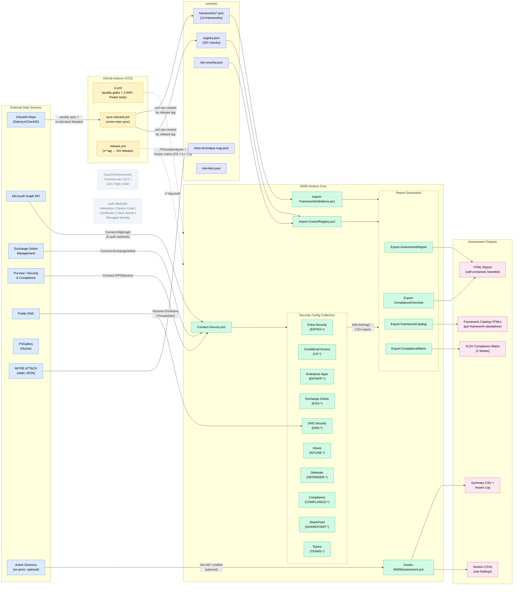

# Upstream Integrations

All external systems that feed data into M365-Assess and the outputs the tool produces. Data flows left-to-right: external sources enter the orchestrator, which produces assessment artifacts.

